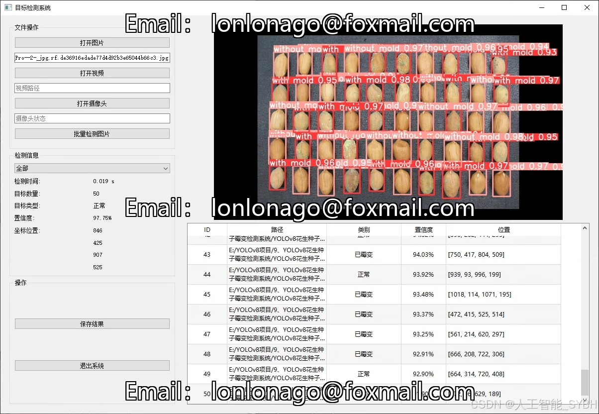
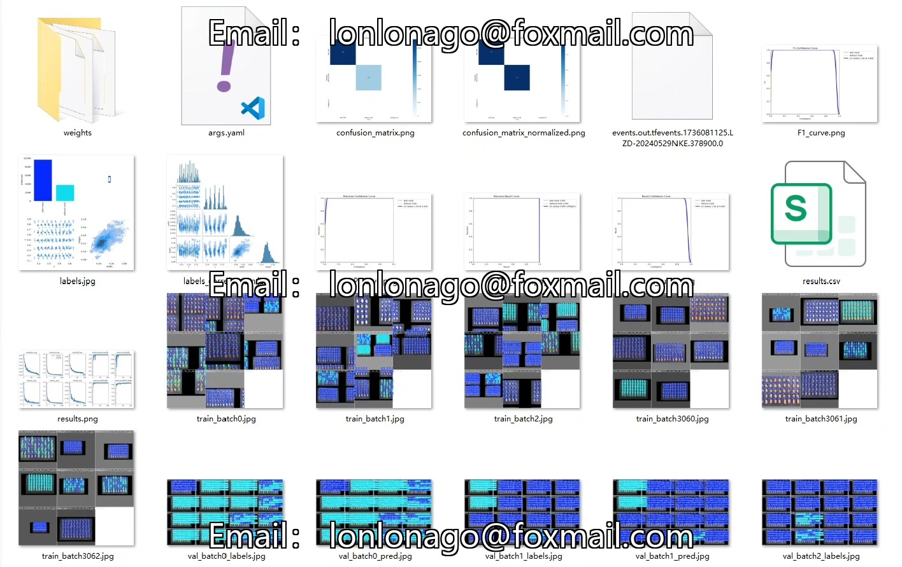
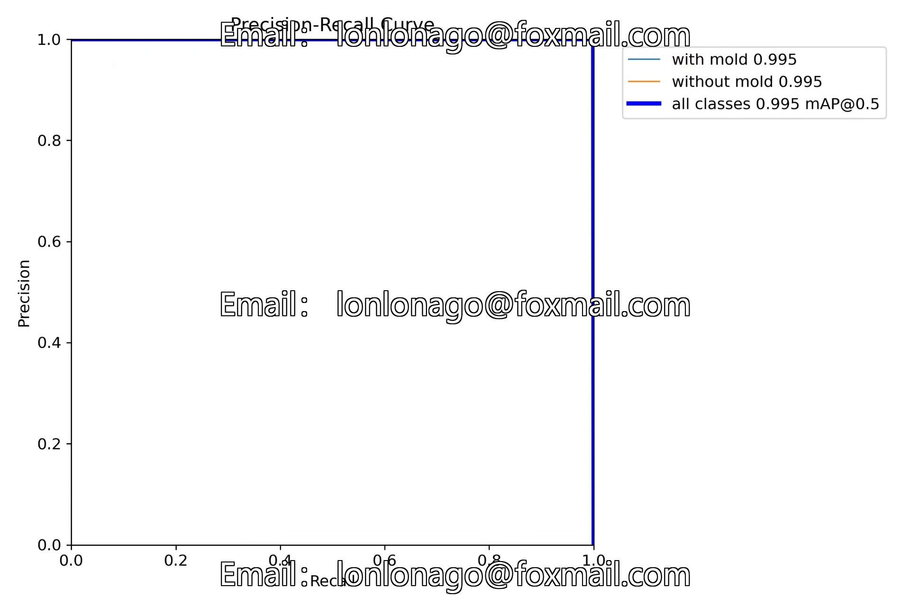
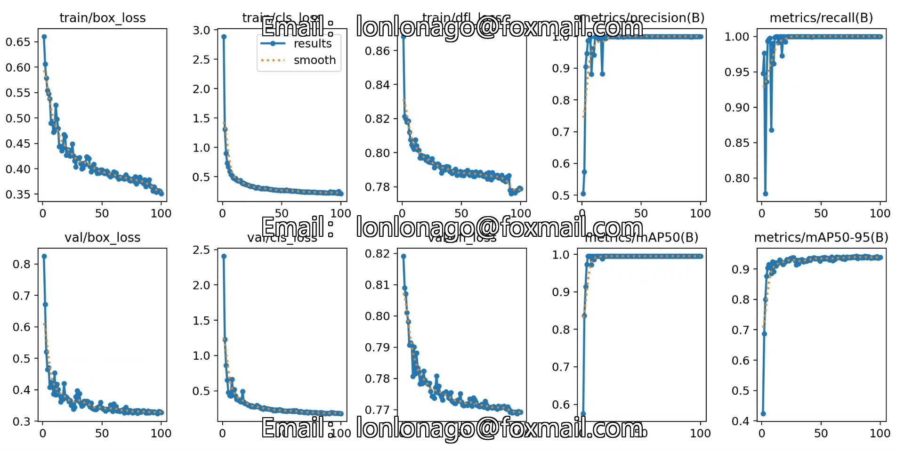
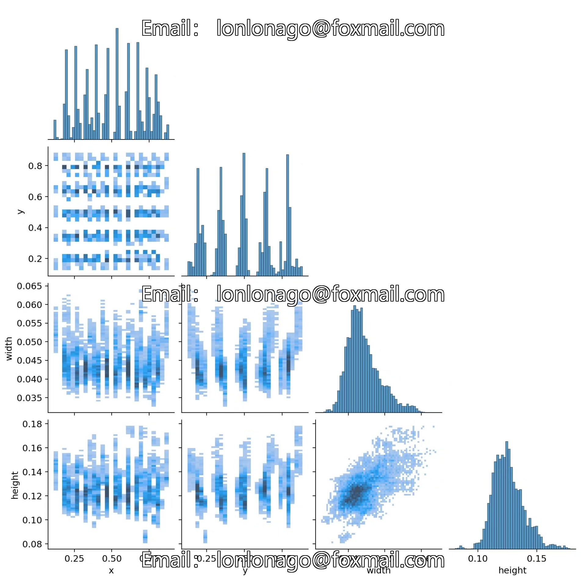
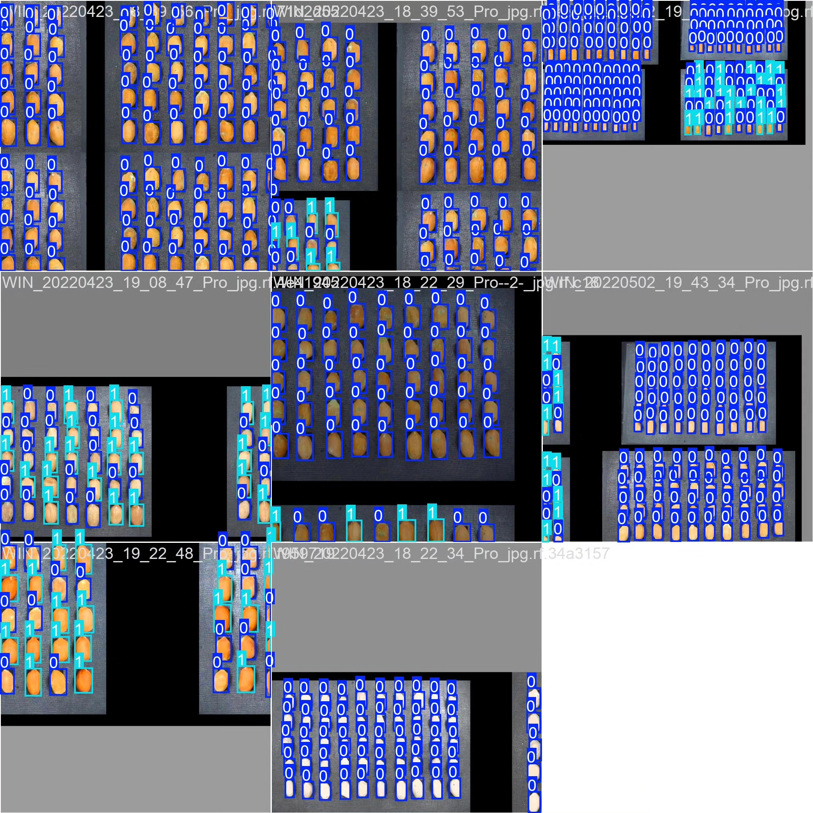
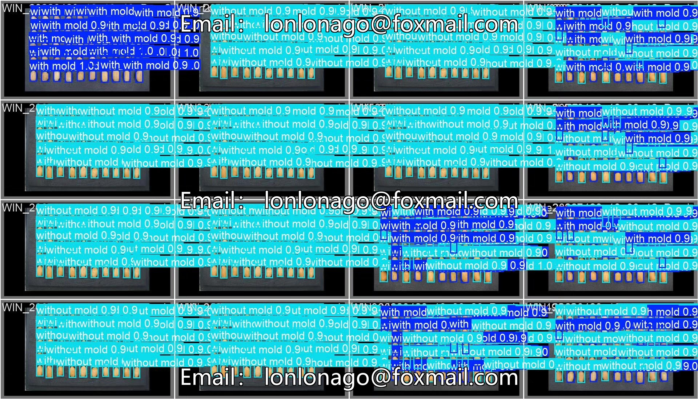

# Pinenut seed mold detection system based on YOLOv8 deep learning

## Body

Based on the YOLOv8 deep learning target detection algorithm, this project has developed a high-efficiency and precise peanut seed mold detection system for automatic recognition of whether peanut seeds have mold. The system categorizes peanut seeds into two types: "with mold" (moldy peanuts) and "without mold" (non-moldy peanuts). Through computer vision technology, it achieves rapid and automated detection. It is suitable for fields such as food processing, agricultural quality inspection, and warehouse management.

The company's products have obtained the official commercial license certification from YOLO.

We provide after-sales service.

After payment, we will provide WeChat ID to answer questions anytime.

Environment configuration: We will provide an environment configuration tutorial, and WeChat will provide Q&A.

Remote installation service: If you need remote configuration, an additional fee of 69 is required,

If the configuration fails, all fees will be refunded (specially for old computers only refund installation fees)

Retraining dataset: After setting up the environment, you can train on your own computer.
If you need us to retrain, just pay 69 + computing power fees (2.5 yuan/hour)

Full after-sales service

## Images

## Payment

Here is a pay link on Stripe ( https://buy.stripe.com/3cs8yP7sY87d0vu9AB ). Please contact me lonlonago@foxmail.com after funding $89, and I will send you a complete data files , thank you!

